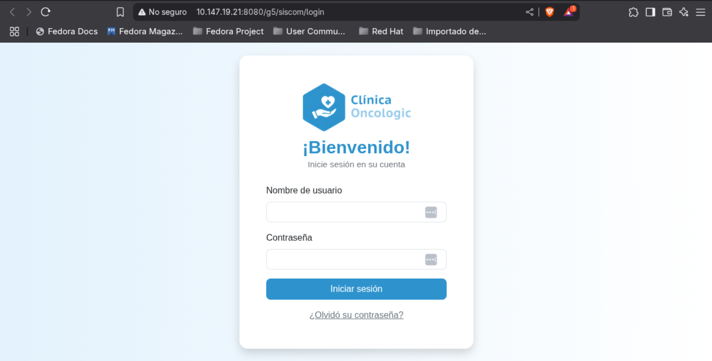

# **OncoLogic Clinic Management System**

**OncoLogic** is a web-based platform designed to optimize the administrative and operational management of an oncology
clinic in Cali. The system centralizes and automates key processes such as:

- 🩺 **Medical and administrative staff management** (registration, specialties, schedules).
- 📋 **Patient administration** (medical records, treatment monitoring).
- 🗓️ **Smart appointment scheduling** (consultations, exams, automatic doctor/office assignment).
- 🔬 **Laboratory integration** (exam and results management).
- 🔒 **Robust security** (user authentication and role-based access control).

### Authors

- [Santiago Valencia](https://github.com/Tiago0507)
- [Juan Manuel Díaz](https://github.com/Juanmadiaz45)
- [Esteban Gaviria](https://github.com/EstebanGZam)

### Technologies Used

- Java 23
- Spring Boot
- Spring Data JPA
- Hibernate
- PostgreSQL
- Docker and Docker Compose
- JUnit (for unit testing)
- JaCoCo (for code coverage measurement)

### Installation and Execution

1. **Clone the repository**

    ```bash
    git clone https://github.com/Computacion-2-2025/proyecto-final-siscom.git
    cd proyecto-final-siscom
    ```

2. **Set up the database with Docker**

   This project uses PostgreSQL as the database. Two environments have been defined in `docker-compose.yml`: one for
   development (`clinic_dev`) and one for testing (`clinic_test`).

   To start the PostgreSQL containers, run:

    ```bash
    docker compose up -d
    ```

   This will create two databases:

    - Development: `clinic_dev` (port 5435)
    - Testing: `clinic_test` (port 5436)

3. **Compile and run the application**

    ```bash
    ./mvnw clean install
    ./mvnw spring-boot:run
    ```

   The API will be available at: [http://localhost:8080/g5/siscom/](http://localhost:8080/g5/siscom/)

4. **Run tests and generate the report**

   Run the unit tests with:

    ```bash
    ./mvnw clean test
    ```

   Then, generate the coverage report with:

    ```bash
    ./mvnw jacoco:report
    ```

5. **View the results**

   The coverage report will be generated at:

   `target/site/jacoco/index.html`

   Open this file in a browser to view the code coverage.

### **Application Deployment**

For this version, the application has deployed both the frontend and backend implementations. Both are on a Tomcat 
server on a computer in classroom 206M. To access both the frontend and backend deployments, go to the following URLs:

- **Local network (IASLAB connection). Backend deployment:**  
  [http://192.168.131.21:8080/g5/siscom/](http://192.168.131.21:8080/g5/siscom/)
- **Remote access (ZeroTier VPN). Backend deployment:**  
  [http://10.147.19.21:8080/g5/siscom/](http://10.147.19.21:8080/g5/siscom/)


- **Local network (IASLAB connection). Frontend deployment:**

  [http://192.168.131.21:8080/g5/syscom/](http://192.168.131.21:8080/g5/siscom/)
- **Remote access (ZeroTier VPN). Frontend deployment:**

  [http://10.147.19.21:8080/g5/syscom/](http://10.147.19.21:8080/g5/siscom/)


**Location of deployment files:**


### Default Users and Passwords

You can log into the web application using the following default credentials:

| Username            | Password            | Role / Description      |
|---------------------|---------------------|-------------------------|
| **admin**           | `admin`             | Full access (superuser) |
| **admin2**          | `admin2`            | Full access (superuser) |
| **doctor1**         | `doctor123`         | Medical personnel       |
| **doctor2**         | `doctor123`         | Medical personnel       |
| **doctor3**         | `doctor123`         | Medical personnel       |
| **patient1**        | `patient123`        | Patient                 |
| **patient2**        | `patient123`        | Patient                 |
| **labtech1**        | `lab123`            | Laboratory technician   |
| **administrative1** | `administrative123` | Administrative staff    |

> **Note:**  
> The users admin and admin2 have full access to all core functionalities from
> the [MVC Workshop Assignment](https://docs.google.com/document/d/1Py-Sxh_E5yLJ0SNuNIP1N5Qo8y5lQbc0/edit?tab=t.0),
> including:
> - Log in
> - Register new users
> - List all users
> - Create roles
> - Associate permissions to a role
> - Assign roles to users
> - Delete roles
> - Remove roles from users
    > 

### 📘 Documentation with Swagger

The REST API for this project was documented using **Swagger**. To review the documentation, follow the paths below:


#### 🔧 Development environment (localhost)

* **Graphical interface:**
  [http://localhost:8080/g5/siscom/swagger-ui/index.html](http://localhost:8080/g5/siscom/swagger-ui/index.html)
* **JSON format:**
  [http://localhost:8080/g5/siscom/v3/api-docs](http://localhost:8080/g5/siscom/v3/api-docs)

#### 🌐 Deployed environment

* **Local network (IASLAB connection):**

    * **Graphical interface:**
      [http://192.168.131.21:8080/g5/siscom/swagger-ui/index.html](http://192.168.131.21:8080/g5/siscom/swagger-ui/index.html)
    * **JSON format:**
      [http://192.168.131.21:8080/g5/siscom/v3/api-docs](http://192.168.131.21:8080/g5/siscom/v3/api-docs)

* **Remote access (ZeroTier VPN):**

    * **Graphical interface:**
      [http://10.147.19.21:8080/g5/siscom/swagger-ui/index.html](http://10.147.19.21:8080/g5/siscom/swagger-ui/index.html)
    * **JSON format:**
      [http://10.147.19.21:8080/g5/siscom/v3/api-docs](http://10.147.19.21:8080/g5/siscom/v3/api-docs)

### Testing the API with Postman

This project includes a Postman collection and environment file to facilitate API testing.


#### Requirements

- Postman must be installed.
- Make sure you have the application running in your local environment. If you do not test it locally, set the
  `base_url` in the Postman environment variable correctly so it works without issues.

#### Steps to Import and Run Postman Tests

1. Download the Postman Files inside the repository, there is a `postman/` directory containing:
    - collection_name.postman_collection.json – the collection of API requests.
    - environment_name.postman_environment.json – the environment with variables.

2. Import Files into Postman
   a) Open Postman
    - Launch the Postman application.

   b) Import the Collection
    - Click the Import button in the top-left corner.
    - Select the collection_name.postman_collection.json file.
    - Click Import.

   c) Import the Environment
    - Click the gear icon (⚙️) in the top-right corner and choose Manage Environments.
    - Click Import.
    - Select the environment_name.postman_environment.json file.

3. Select the Environment
    - Use the environment dropdown in the top-right corner of Postman to select the imported environment.

4. Run the Test Collection
    - Go to the Collections tab in Postman.
    - Select the imported collection.
    - Click the Run button (▶️ icon or "Runner").
    - Make sure the correct environment is selected in the Collection Runner.
    - Click Run collection_name to execute the tests.
